# :coffee: Autocazing

## :mag: 서비스 소개

가게 운영에 있어 발주는 상시로 해야 하는, 많은 시간을 들여야 하는 중요하면서도 귀찮은 과정입니다. 발주가 제대로 되지 않으면 가게 운영 자체가 힘들어집니다.

재고의 분석, 자동화를 통한 자동 발주 시스템이 있다면 가게 운영에 큰 도움이 될 것입니다. 기업의 전사적 자원 관리(ERP)를 개인 업장에 제공, 이에 자동화를 더해 효율적이고 더 체계적인 재고 관리에 힘을 실어줄 서비스를 기획하게 되었습니다.

> 개발 기간

-   2024.04.08 - 2024.05.19

## :tv: 서비스 화면

| 기능                 |                       설명                        | 이미지 예시                                                                           |
| -------------------- | :-----------------------------------------------: | ------------------------------------------------------------------------------------- |
| **메인 페이지**      |                   **대시보드**                    | 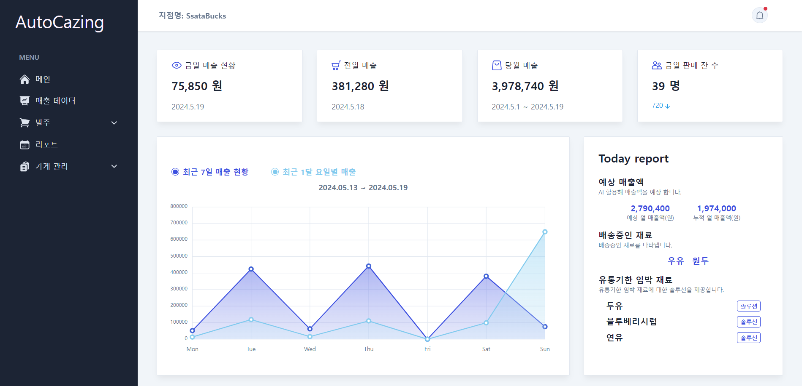     |
|                      |               **알림 리스트 조회**                | 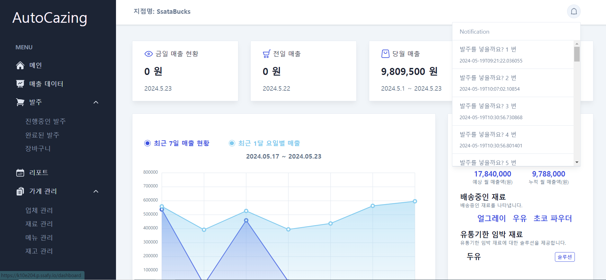     |
| **매출 데이터 조회** |               **매출 데이터 조회**                | 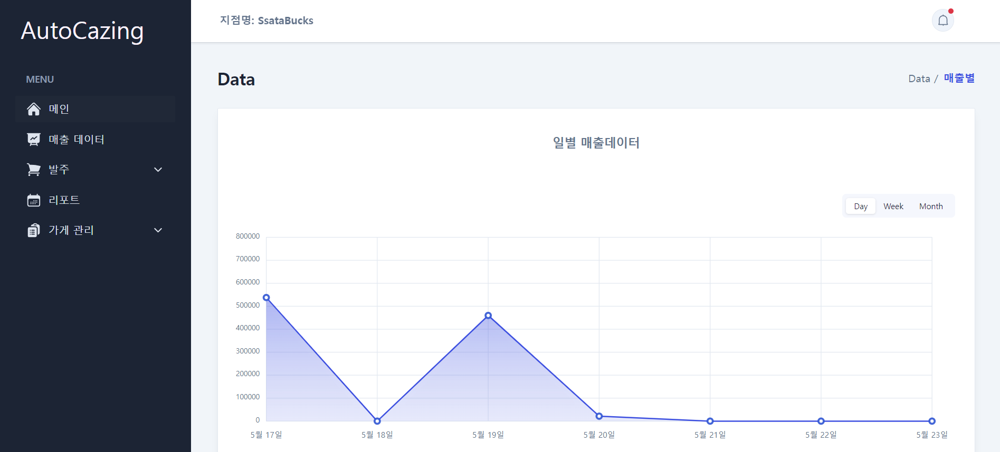         |
| **발주 관리**        |              **진행 중인 발주 관리**              | 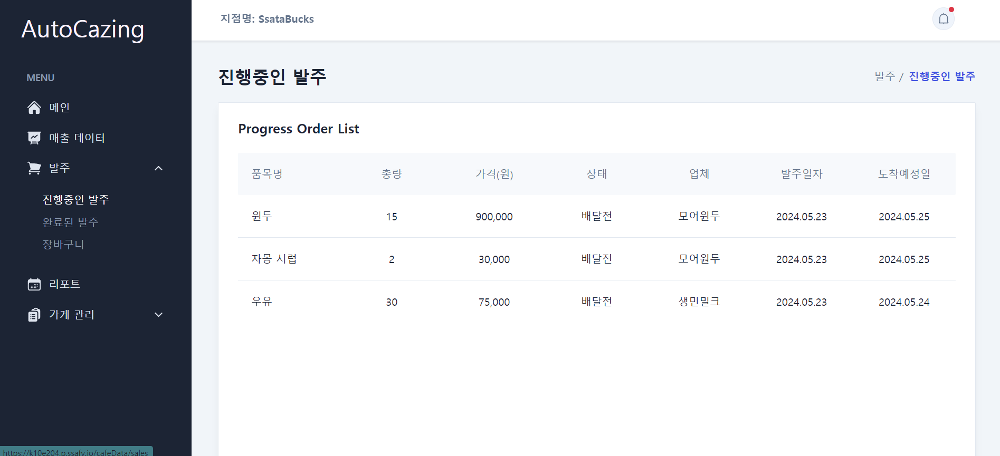      |
|                      |          **재료 발주 리스트 추가 알림**           | 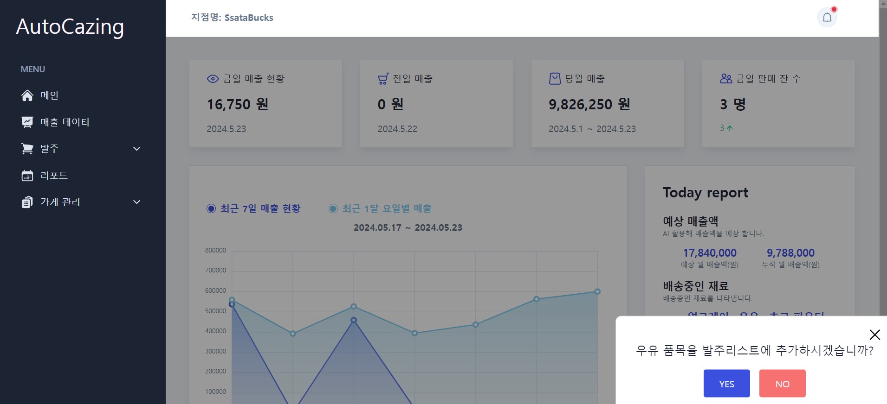  |
|                      |               **완료된 발주 관리**                | 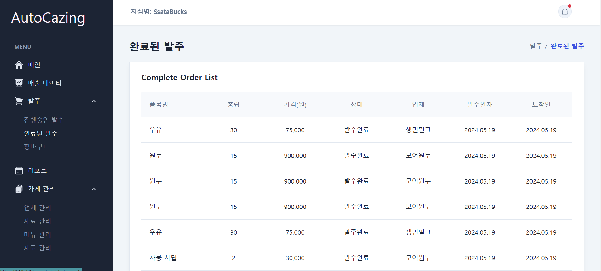      |
|                      |                 **장바구니 관리**                 | 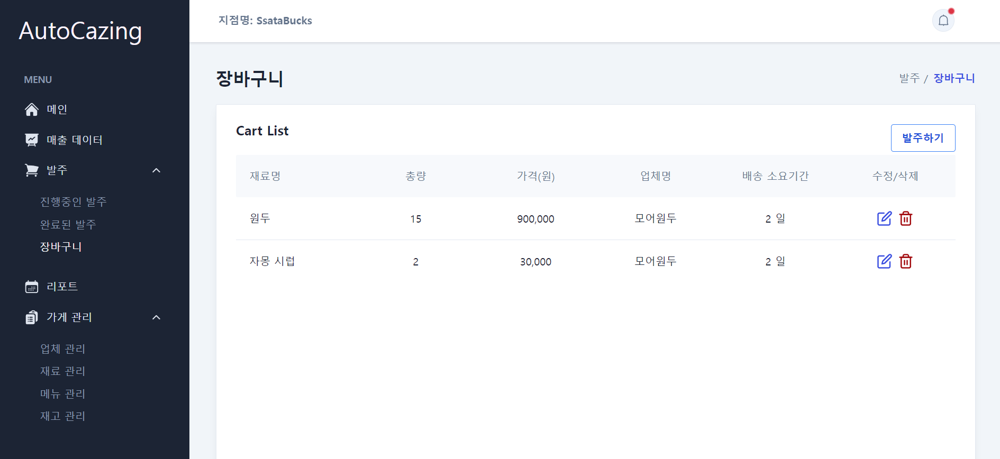      |
| **리포트 조회**      |             **지난 리포트 전체 조회**             | 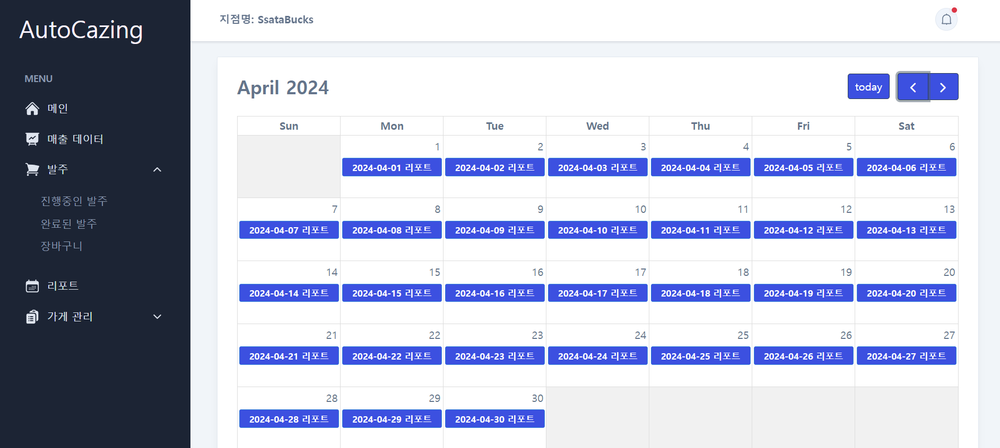       |
|                      |             **지난 리포트 상세 조회**             | 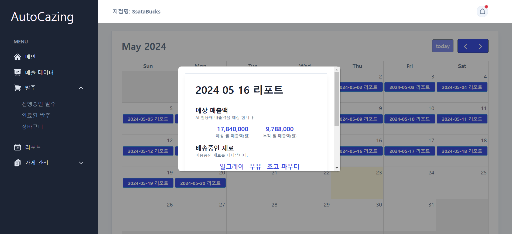       |
|                      | **유통기한 마감 임박 재료 처리 방법 솔루션 제공** | 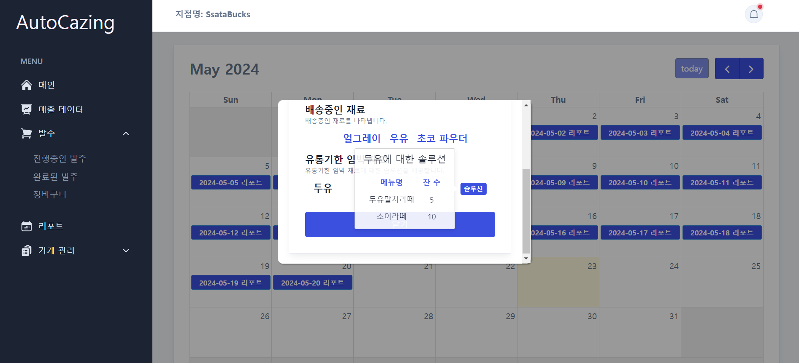       |
| **가게 관리**        |                   **업체 관리**                   | 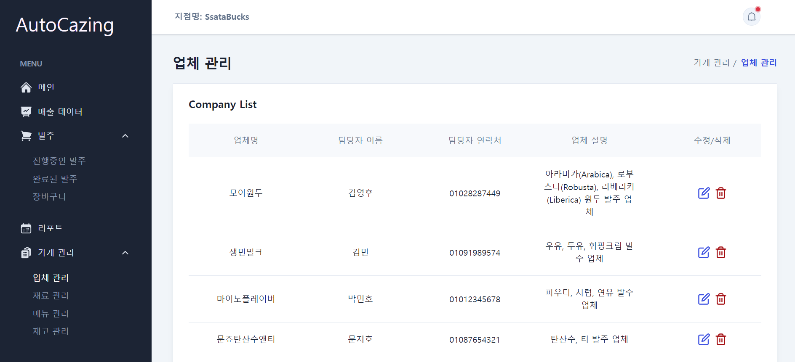 |
|                      |                   **재료 관리**                   | 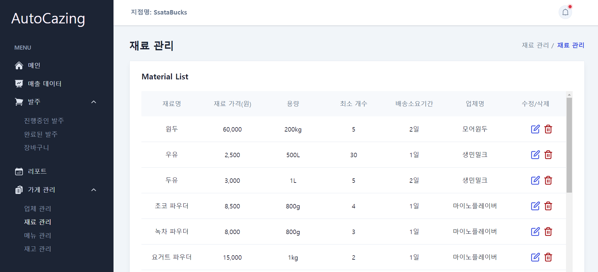 |
|                      |                   **메뉴 관리**                   | 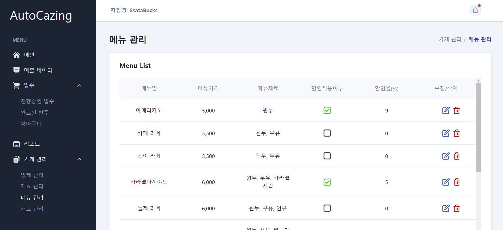 |
|                      |                   **재고 관리**                   |  |

## :page_facing_up: 기술 스택

### FrontEnd

### BackEnd

### Infrastructure

  
  

### Communication

 
 

## ERD

### INVENTORY SERVICE

### ALERT SERVICE

### SOLUTION SERVICE

## 아키텍쳐

## 팀원 소개

<table>
  <tr style="width : 100%">
    <td align="center"> 김민</td>
    <td align="center"> 김영후</td>
    <td align="center"> 문지호</td>
    <td align="center"> 박민호</td>
    <td align="center"> 위동민</td>
    <td align="center"> 진성민</td>
  </tr>
</table>
